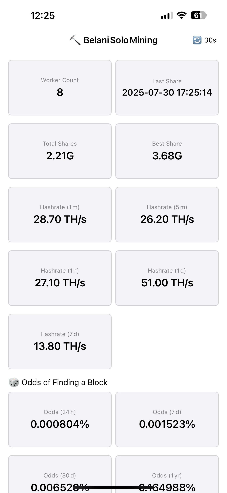
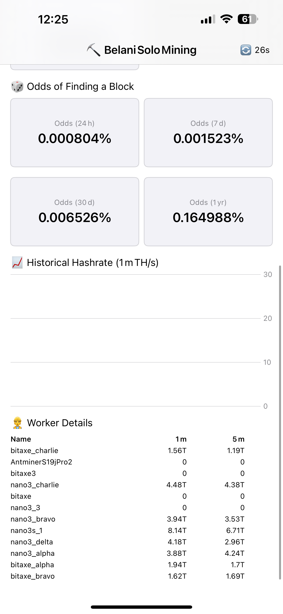

# 📱 Solo Mining Stats – iOS App

A native iOS app for monitoring your Bitcoin solo mining operation. This SwiftUI-based app displays live metrics from your CKPool-based stratum server, including worker hashrates, block discovery odds, and historical performance.

---

## 🚀 Features

- 🔄 Auto-refreshing metrics from a FastAPI backend
- 📊 Stats cards for:
  - Worker count
  - Best share
  - Hashrates (1m, 5m, 1h, 1d, 7d)
  - Block finding odds (24h, 7d, 30d, 1y)
- 👷 Per-worker stats table with live hashrates
- 📈 Line chart for historical hashrate (1m TH/s)
- 📱 Home Screen and Lock Screen widgets (via WidgetKit)
- 🔒 Works over local/private network

---

## 📸 Screenshots

### Dashboard View


### Worker Details View


---

## 📦 Requirements

- iOS 16+
- Xcode 15+
- Backend API running at `http://<your-api-ip>:8000/metrics`
- Swift + SwiftUI + Charts + WidgetKit

---

## 📁 Project Structure

- `MiningStatsApp.swift` – Main app and dashboard UI
- `Widget.swift` – Home/Lock screen widgets
- `Assets.xcassets` – App icons and theme
- `Info.plist` – Network permissions

---

## 🧩 Widgets

This app includes 5 widgets:

| Name           | Type         | Metric          |
|----------------|--------------|------------------|
| Mining Stats   | Home Screen  | Workers, Hashrate, Best, Odds |
| Worker Count   | Lock Screen  | # of Workers     |
| Best Shares    | Lock Screen  | Best share       |
| Hashrate       | Lock Screen  | 1m TH/s          |
| 1y Odds        | Lock Screen  | Yearly block odds |

All widgets refresh every 5 minutes and are configurable via WidgetKit.

---

## 🛠️ Configuration

Update the API endpoint in:

```swift
// MiningStatsApp.swift
private let apiURL = URL(string: "http://<your-api-ip>:8000/metrics")!
```

Make sure your iPhone is on the same network as the mining server or VPN-connected.

---

## 🙌 Credits

This app is a native rewrite of a Streamlit-based dashboard, optimized for mobile use and quick stat checks.
